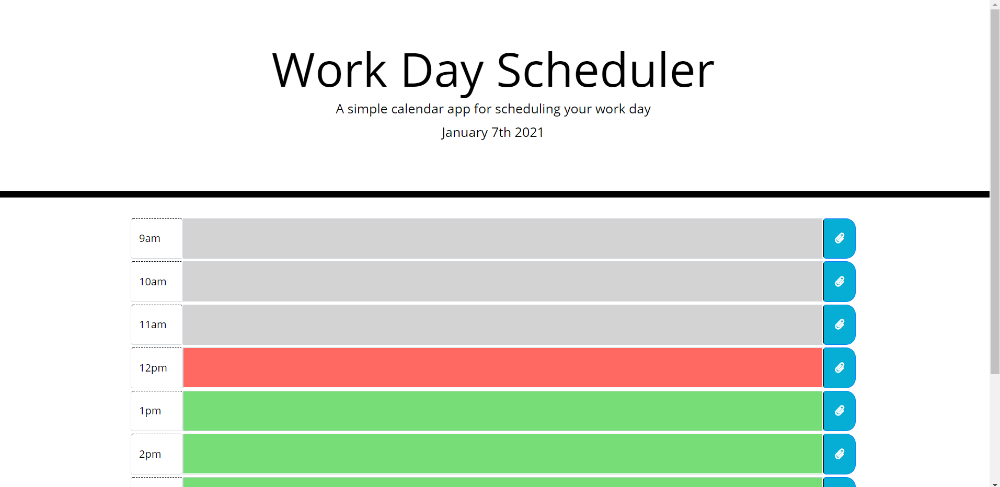

# Work Day Scheduler

The work day scheduler is a website that allows you to schedule out your work day. This tells you what day it is, and will keep track of the time by changing the color of the time slot. This also keeps your information in, even if you leave the screen or refresh.

<a href = "https://chrisrisseler.github.io/Scheduler/">Here is a link to the scheduler.</a>

## Using Work Day Scheduler

To use the scheduler, you just need to click in the time slot you wish to schedule somthing, and type. Then click the button to the side of the time slot to save this to your daily schedule. The date is at the top of the screen, and the time slot will automatically change color to let you know what hour you are in.

  

## Contributors

Thanks to the following people who have contributed to this project:

* Chris R.
* Alper G.
* Carl V.
* Joshua B.
* Tim A.
* Alistair R.

## Contact

If you want to contact me you can reach me at chrisrisseler43@gmail.com.

## License
<!--- If you're not sure which open license to use see https://choosealicense.com/--->

This project uses the following license: MIT Liscence Copywright (c) 2020 Chris Risseler <a href = "assets/license.md">License Here.</a>